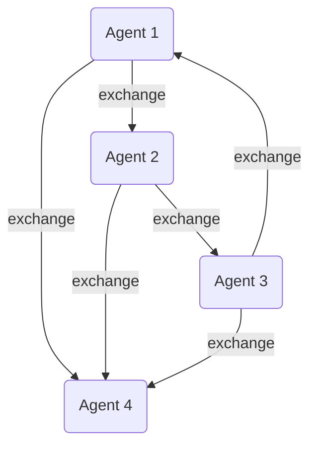

# LangGraph 에이전트 디자인 패턴 모음

> 본 문서는 **LangGraph** 기반 에이전트 시스템 설계 시 자주 사용되는 두 가지 멀티-에이전트 패턴(**Supervisor**, **Swarm**)을 정리합니다. 각 패턴의 개념·장단점·사용 시나리오와 함께 **Mermaid** 다이어그램, 그리고 LangGraph에서의 구현/프리빌트 지원 여부를 포함합니다.

---

## 1. Supervisor Pattern

### 1.1 개념
하나의 **Supervisor(감독자)** 에이전트가 여러 **Worker(작업자)** 에이전트를 통제합니다. Supervisor는
1) 작업 분할 → 2) Worker 할당 → 3) 결과 취합 → 4) 후처리/의사결정 흐름을 담당합니다.

### 1.2 Mermaid 다이어그램
```mermaid
graph TD
    S(Supervisor Agent)
    W1(Worker Agent 1)
    W2(Worker Agent 2)
    W3(Worker Agent 3)

    S --|Task A| W1
    S --|Task B| W2
    S --|Task C| W3

    W1 --|Result A| S
    W2 --|Result B| S
    W3 --|Result C| S

    S -->|Aggregated Decision| OUT((Final Output))
```

### 1.3 장단점
- **장점**: 중앙 집권적 관리로 로깅·모니터링·오류 처리 용이, 비즈니스 로직 단일화.
- **단점**: Supervisor가 병목·단일 장애 지점(SPOF)이 될 수 있음. 확장성 제약.

### 1.4 사용 예시
- 문서 분류 → 전문 분야별 Worker가 요약/분석 후 Supervisor가 최종 리포트 작성.
- 소프트웨어 개발 에이전트: Supervisor가 Issue를 분할, 각 Worker가 코드/테스트/리뷰 수행.

### 1.5 LangGraph 지원 현황
| 항목 | 지원 여부 | 비고 |
| --- | --- | --- |
| **프리빌트 템플릿** | ⚡ **있음** | `Multi-Agent > Network` 템플릿이 Supervisor-Worker 구조 예시 제공 |
| **API 지원** | ✅  | `Command` 객체로 Worker → Supervisor 결과 전달, `fan-out/fan-in` 형태로 구현 가능 |
| **Persistence** | ✅  | 각 Worker Thread 상태를 Checkpointer로 개별 저장 가능 |

> 템플릿 사용: `langgraph template multi_agent` 실행 후 Supervisor/Worker 노드를 수정하세요.

---

## 2. Swarm Pattern

### 2.1 개념
다수의 **Peer** 에이전트(동등한 노드)가 서로 상태/지식을 공유하며 분산적으로 문제를 해결합니다. 중앙 컨트롤러가 없고, 에이전트들이 반복적으로 의견을 교환하여 수렴(consensus)하거나 창발적 행동(emergence)을 이끌어냅니다.

### 2.2 Mermaid 다이어그램


### 2.3 장단점
- **장점**: 고가용성, 확장성 우수, 단일 장애 지점 없음, 창발적 해결책 기대.
- **단점**: 수렴 보장 어려움, 디버깅·모니터링 복잡, 리소스 소비 증가.

### 2.4 사용 예시
- 브레인스토밍/아이디어 생성: 여러 에이전트가 자유롭게 아이디어 제안·투표.
- 보안 침해 탐지: 에이전트들이 서로 알림·협의하여 이상 징후 확인.

### 2.5 LangGraph 지원 현황
| 항목 | 지원 여부 | 비고 |
| --- | --- | --- |
| **프리빌트 템플릿** | ⚠️ **미제공(22.05 기준)** | Swarm 전용 템플릿은 없으나 **Graph API**로 직접 모델링 가능 |
| **API 지원** | ✅ | Topic/Context 채널로 글로벌 상태 공유, `parallel` & `reducer` 패턴으로 동시 실행 후 합산 가능 |
| **Persistence** | ✅ | 각 Peer Thread 체크포인트 저장 및 Time-Travel로 경로 비교 가능 |

> Swarm 패턴 구현 시 `branching` + `parallel` 가이드 참조: <https://langchain-ai.github.io/langgraph/how-tos/branching/>

---

## 3. 선택 가이드
| 조건 | 추천 패턴 |
| --- | --- |
| 작업 분할·집계가 명확하고, 중앙 집중 제어가 허용되는 경우 | **Supervisor** |
| 고가용성·분산 합의·창발성 중요, 중앙 장애 지점이 허용되지 않는 경우 | **Swarm** |

---

### 참고 문서
- LangGraph **Multi-Agent Systems** Concept: <https://langchain-ai.github.io/langgraph/concepts/multi_agent/>
- How-to **Create Branches for Parallel Execution**: <https://langchain-ai.github.io/langgraph/how-tos/branching/>
- Functional API `Command` & Interrupt: <https://langchain-ai.github.io/langgraph/concepts/human_in_the_loop/>

> 패턴 선택 후 **langsmith**로 추적·분석하여 각 에이전트 간 메시지 흐름과 토큰 소비를 시각화하는 것을 권장합니다. 