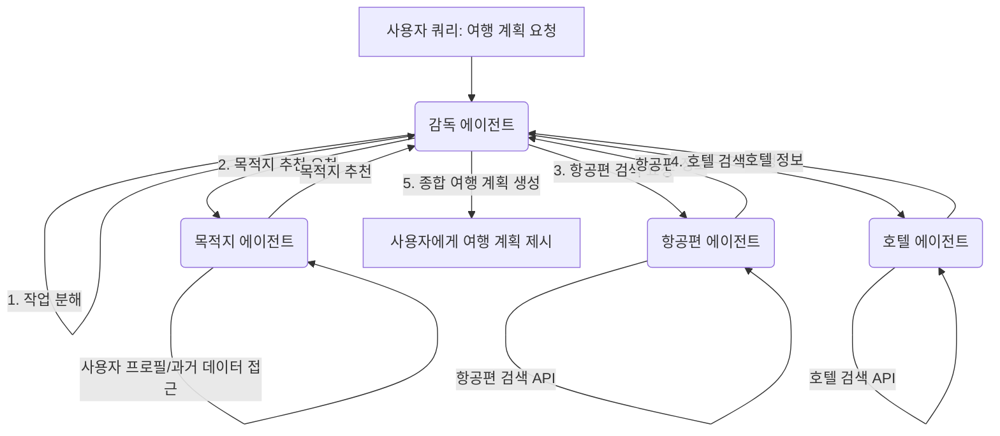

https://aws.amazon.com/blogs/machine-learning/build-multi-agent-systems-with-langgraph-and-amazon-bedrock/

## LangGraph와 Amazon Bedrock을 활용한 멀티 에이전트 시스템 구축

이 AWS 블로그 게시물은 오픈 소스 멀티 에이전트 프레임워크인 LangGraph를 Amazon Bedrock과 통합하여 강력하고 상호작용적인 멀티 에이전트 애플리케이션을 구축하는 방법을 설명합니다. 이러한 애플리케이션은 그래프 기반 오케스트레이션을 사용합니다.

**핵심 내용:**

*   **LLM 에이전트의 한계:** 단일 LLM 에이전트는 복잡한 워크플로우 관리, 외부 데이터 연결, 여러 AI 기능 조정 등 실제 애플리케이션의 요구 사항을 충족하는 데 어려움이 있습니다. 특히, 많은 도구에 접근할 수 있는 에이전트의 비효율적인 도구 선택, 복잡한 컨텍스트 정보 관리의 한계, 다양한 전문 분야(계획, 연구, 분석 등)에 대한 요구 사항 등이 주요 문제입니다.
*   **멀티 에이전트 아키텍처의 필요성:** 이러한 문제를 해결하기 위해 주요 시스템을 독립적으로 작동하는 더 작고 전문화된 에이전트로 분해하는 멀티 에이전트 아키텍처가 필요합니다. 이를 통해 작업 분산을 효율화하고 다양한 애플리케이션 구성 요소를 전문적으로 처리할 수 있습니다.
*   **LangGraph 소개:** LangChain의 일부인 LangGraph는 그래프 기반 아키텍처를 통해 에이전트 워크플로우를 오케스트레이션합니다. 복잡한 프로세스를 처리하고 에이전트 상호 작용 전반에 걸쳐 컨텍스트를 유지하며, 감독 제어 패턴과 메모리 시스템을 사용하여 조정을 수행합니다.
    *   **구성 요소:**
        *   **상태(State):** 애플리케이션의 현재 스냅샷을 나타내는 공유 데이터 구조입니다.
        *   **노드(Nodes):** 에이전트의 로직을 인코딩하는 Python 함수입니다.
        *   **엣지(Edges):** 현재 상태를 기반으로 다음에 실행할 노드를 결정하는 Python 함수입니다. 조건부 분기 또는 고정 전환이 될 수 있습니다.
    *   **핵심 기능:**
        *   **메모리:** 애플리케이션 상태의 임의 측면을 유지하여 대화 및 기타 업데이트의 메모리를 지원합니다.
        *   **Human-in-the-loop:** 상태가 체크포인트되므로 실행을 중단하고 재개할 수 있어 사람의 입력을 통해 주요 단계에서 결정, 유효성 검사 및 수정을 수행할 수 있습니다.
*   **LangGraph Studio:** AI 에이전트 개발을 위해 특별히 설계된 통합 개발 환경(IDE)으로, 그래프 시각화, 실행 모니터링 및 런타임 디버깅 기능을 제공합니다.
*   **솔루션 개요 (여행 계획 예시):**
    *   사용자 쿼리: "여행지를 추천해주고 항공편과 호텔을 검색해주세요. 2025년 3월 15일에 5일 동안 여행하고 싶어요."
    *   **작업 흐름:**
        1.  **감독 에이전트(Supervisor Agent):** 초기 쿼리를 받아 순차적 작업으로 분해합니다 (목적지 추천, 항공편 검색, 호텔 예약).
        2.  **목적지 에이전트(Destination Agent):** 사용자 프로필에 접근하여 과거 데이터를 분석하고 목적지를 추천한 후 감독 에이전트에게 전달합니다.
        3.  **항공편 에이전트(Flight Agent):** 감독 에이전트로부터 목적지를 받아 해당 날짜의 항공편을 검색합니다.
        4.  **호텔 에이전트(Hotel Agent):** 목적지 도시의 호텔을 검색합니다.
        5.  **감독 에이전트:** 추천 사항을 종합하여 목적지 근거, 항공편 옵션, 호텔 제안을 포함한 전체 여행 계획을 사용자에게 제시합니다.
*   **핵심 구성 요소 (각 에이전트):**
    *   `graph.py`: 에이전트의 워크플로우 및 의사 결정 로직을 정의합니다.
    *   `tools.py`: 에이전트 기능의 구체적인 구현을 포함합니다 (예: `search_flights`, `suggest_hotels`).
*   **고려 사항:** 멀티 에이전트 아키텍처는 에이전트 조정, 상태 관리, 통신, 출력 통합, 가드레일, 컨텍스트 유지, 오류 처리 및 오케스트레이션을 신중하게 고려해야 합니다. 그래프 기반 아키텍처는 비선형 통신 패턴과 명확한 시스템 시각화를 통해 복잡한 워크플로우를 가능하게 합니다.

**결론:**

LangGraph와 Amazon Bedrock의 통합은 정교한 AI 애플리케이션을 위한 강력한 프레임워크를 제공하여 멀티 에이전트 시스템 개발을 크게 발전시킵니다. 이 조합은 LangGraph의 오케스트레이션 기능과 Amazon Bedrock의 파운데이션 모델(FM)을 활용하여 확장 가능하고 효율적인 시스템을 만듭니다.

**Mermaid 다이어그램 (여행 계획 예시 기반):**

