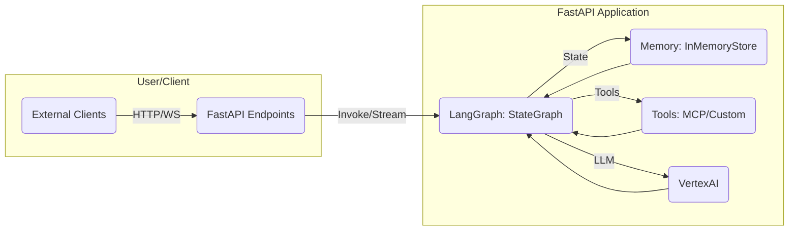

# FastAPI 기반 LangGraph 에이전트 API 아키텍처 (Side Project Edition)

> 이 문서는 **LangGraph 에이전트**를 **FastAPI** 백엔드로 서빙하는 단순화된 아키텍처 패턴을 제안합니다. 사이드 프로젝트에 적합하도록 RESTful API, WebSocket 스트리밍, 인메모리 상태 관리를 중심으로 설명합니다.

---

## 1. 주요 구성 요소



| 컴포넌트 | 설명 | 사용 기술 예시 |
| --- | --- | --- |
| **FastAPI Endpoints** | REST(동기), WebSocket(스트리밍), SSE | `APIRouter`, `WebSocket`, `StreamingResponse` |
| **LangGraph Instance** | `StateGraph`로 정의된 컴파일된 그래프, 에이전트 로직 | `StateGraph`, `Pregel` |
| **Memory/Checkpointer** | 스레드별 상태 저장, 휘발성 메모리 | `langgraph.checkpoint.MemorySaver` (기본 `InMemoryStore` 사용) |
| **Tools** | MCP 서버, 커스텀 함수, 외부 API 호출 | `langchain_mcp_adapters`, `Tool` 클래스 |
| **LLM Provider** | Google Vertex AI | `langchain_google_vertexai` |
| **Task Queue (Optional)** | 간단한 백그라운드 작업 | FastAPI `BackgroundTasks` |

---

## 2. API 엔드포인트 설계 예시

| HTTP 메서드 | 경로 | 설명 | 응답 타입 |
| --- | --- | --- | --- |
| `POST` | `/invocations` | 그래프 동기 실행, 단일 결과 반환 | JSON (최종 상태) |
| `POST` | `/stream` | 그래프 스트리밍 실행 (SSE) | `text/event-stream` |
| `WS` | `/ws/stream` | 그래프 스트리밍 실행 (WebSocket) | JSON (단계별 업데이트) |
| `GET` | `/threads/{thread_id}/state` | 특정 스레드 상태 조회 | JSON |
| `POST` | `/threads/{thread_id}/interrupt` | 특정 스레드에 `Command` 전송 (HITL) | JSON (업데이트된 상태) |
| `GET` | `/health` | 서비스 헬스 체크 | JSON |

---

## 3. 상태 관리 (State Management)

* **스레드 ID (Thread ID)**: 각 대화/세션을 `thread_id`로 구분. 클라이언트가 요청 시 포함.
* **Checkpointer**: LangGraph의 `MemorySaver`를 사용하여 스레드별 상태 스냅샷을 인메모리에 저장합니다. 애플리케이션 재시작 시 상태는 휘발됩니다.
  ```python
  from langgraph.checkpoint.memory import MemorySaver
  memory = MemorySaver() # InMemoryStore 사용
  # graph.with_config(configurable={"thread_id": "some_thread_id", "checkpointer": memory})
  ```
* **상태 로드**: 각 요청 시 `thread_id`를 `configurable`에 포함하여 그래프를 실행하면, `MemorySaver`가 해당 스레드의 상태를 자동으로 로드하거나 새로 생성합니다.

---

## 4. 스트리밍 처리

1. **Server-Sent Events (SSE)**: `StreamingResponse` + `async generator` 조합.
   * 장점: 간단, HTTP 표준.
   * 단점: 단방향 (서버 → 클라이언트).
2. **WebSocket**: `WebSocket` 클래스 직접 사용.
   * 장점: 양방향 통신, HITL Command 전송 용이.
   * 단점: SSE보다 구현 복잡성 약간 증가.

```python
# SSE 예시 (langgraph.astream_events 사용)
from fastapi import FastAPI, Request
from fastapi.responses import StreamingResponse
import json # SSE 데이터는 문자열이어야 하므로 json.dumps 필요

app = FastAPI()
# graph = ... (StateGraph 인스턴스, MemorySaver와 함께 설정)
# memory = MemorySaver()

@app.post("/stream")
async def stream_graph(request: Request):
    body = await request.json()
    thread_id = body.get("thread_id", "default_thread") # 스레드 ID가 없으면 기본값 사용
    inputs = body.get("inputs")

    async def event_generator():
        # MemorySaver를 사용하는 경우, config에 checkpointer 명시 불필요 (graph 생성 시 주입)
        config = {"configurable": {"thread_id": thread_id}}
        async for chunk in graph.astream_events(inputs, config, version="v1"):
            yield f"event: {chunk['event']}\ndata: {json.dumps(chunk['data'])}\n\n"

    return StreamingResponse(event_generator(), media_type="text/event-stream")
```

---

## 5. 디렉터리 구조 (참고 - 간소화 버전)

```
app/
├── main.py             # FastAPI 앱, 라우터 설정
├── api/
│   ├── __init__.py
│   ├── v1/
│   │   ├── __init__.py
│   │   ├── endpoints.py    # API 라우트 정의
│   │   └── schemas.py      # Pydantic 요청/응답 모델
├── core/
│   ├── __init__.py
│   └── config.py         # 환경 변수, 설정 로드 (GEMINI_API_KEY 등)
├── graph/
│   ├── __init__.py
│   ├── instance.py       # StateGraph 인스턴스 생성/컴파일, MemorySaver 설정
│   └── tools.py          # 커스텀 도구 정의
```

> 이 아키텍처는 사이드 프로젝트를 위한 가이드라인입니다. 기능이 확장됨에 따라 필요한 부분을 추가하거나 변경할 수 있습니다.
