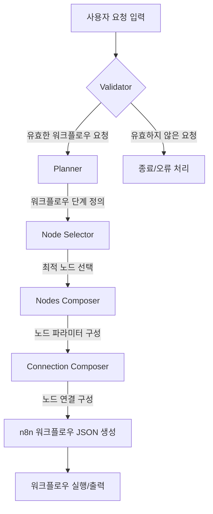
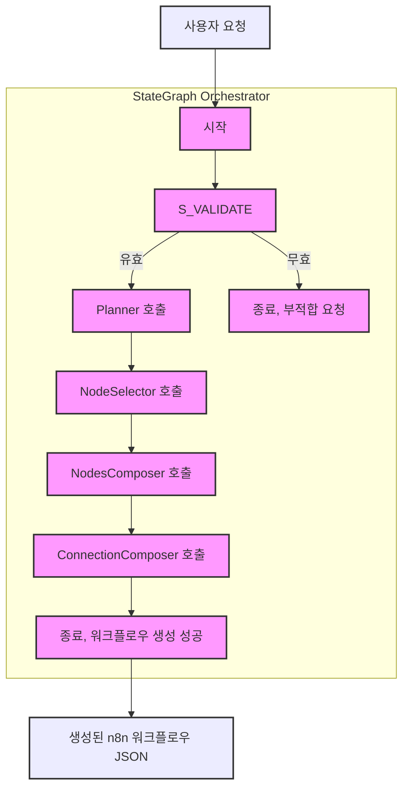

# n8n AI 에이전트 시스템 분석

이 프로젝트는 사용자의 요청을 n8n 워크플로우로 변환하기 위해 여러 단계의 AI 에이전트(여기서는 "체인(chain)"이라고 불립니다)를 사용합니다. 각 에이전트는 특정한 작업을 수행하며, 이전 에이전트의 출력을 입력으로 사용합니다.

## 주요 에이전트 및 역할

1.  **`Validator` (유효성 검사기)**
    *   **소스 파일**: `packages/@n8n/ai-workflow-builder/src/chains/validator.ts`
    *   **역할**: 사용자의 프롬프트가 실제로 워크플로우 생성을 요청하는 것인지, 아니면 일반적인 질문인지를 판단합니다.
    *   **프롬프트 특징**: 워크플로우 요청의 유효/무효 예시를 포함하여, 자동화나 서비스 연결과 관련된 내용인지 분석하도록 지시합니다.

2.  **`Planner` (플래너)**
    *   **소스 파일**: `packages/@n8n/ai-workflow-builder/src/chains/planner.ts`
    *   **역할**: 유효한 워크플로우 요청을 받으면, 이를 n8n 노드로 구현할 수 있는 명확하고 순차적인 단계로 분해합니다.
    *   **프롬프트 특징**: 사용자 요청에 명시된 내용만을 기반으로 단계를 만들고, 불필요한 단계를 추가하지 않도록 엄격하게 지시합니다. 단계별 설명 예시와 JSON 출력 형식을 정의합니다.

3.  **`Node Selector` (노드 선택기)**
    *   **소스 파일**: `packages/@n8n/ai-workflow-builder/src/chains/node-selector.ts`
    *   **역할**: 플래너가 정의한 각 워크플로우 단계에 가장 적합한 n8n 노드를 허용된 노드 목록에서 선택합니다.
    *   **프롬프트 특징**: 허용된 노드 목록에 있는 정확한 노드 이름만 사용하도록 강조하며, 기능, 통합, 효율성을 기준으로 노드를 선택하도록 안내합니다. 각 노드 선택에 대한 이유와 함께 점수를 매기도록 합니다.
    *   **주요 목표**: `Planner`가 생성한 각 워크플로우 단계를 구현하는 데 가장 적합한 n8n 노드를 제공된 허용 노드 목록 내에서 추천합니다.
    *   **선택 가능 대상**: `Node Selector`는 프롬프트의 입력 정보 중 하나인 `<allowed_n8n_nodes>`를 통해 선택 가능한 노드의 목록과 각 노드에 대한 설명을 전달받습니다. 이 목록을 기준으로 노드를 선택합니다.
    *   **핵심 지침**:
        *   제공된 `<allowed_n8n_nodes>` 목록의 정확한 전체 노드 이름(예: "n8n-nodes-base.if")만 사용하도록 강조합니다.
        *   허용 목록에 없는 노드는 절대 제안하지 않도록 합니다.
        *   노드 선택 기준: 기능성, 통합성, 효율성.
        *   결과로 각 추천 노드에 대한 적합성 점수와 선택 이유를 포함하여 선호도 순으로 정렬된 목록을 반환합니다.

4.  **`Nodes Composer` (노드 구성기)**
    *   **소스 파일**: `packages/@n8n/ai-workflow-builder/src/chains/nodes-composer.ts`
    *   **역할**: 선택된 각 n8n 노드에 대해 완전한 형태의 노드 구성(파라미터 설정 포함)을 생성합니다.
    *   **프롬프트 특징**: 노드 이름, 타입, 파라미터의 정확한 구조를 생성하고, 특히 n8n 표현식(`={{ $('Node Name').item.json.field }}`)의 올바른 형식을 매우 강조합니다. IF 노드와 Set 노드 등 특정 노드 구성에 대한 상세한 가이드라인과 예시를 제공합니다. 워크플로우 설명을 위한 스티키 노트 추가도 지시합니다.

5.  **`Connection Composer` (연결 구성기)**
    *   **소스 파일**: `packages/@n8n/ai-workflow-builder/src/chains/connection-composer.ts`
    *   **역할**: 구성된 노드들을 논리적인 순서로 연결하여 실행 가능한 n8n 워크플로우를 완성합니다.
    *   **프롬프트 특징**: 노드의 표시 이름("name" 필드)을 사용하여 연결을 정의하도록 하고, 데이터 흐름, 루프 방지, IF 노드와 같은 분기 노드의 출력 연결(0번 TRUE, 1번 FALSE) 규칙 등을 상세히 설명합니다. 최종적으로 "connections" 객체를 포함하는 JSON을 출력하도록 합니다.

이러한 에이전트들은 `packages/@n8n/ai-workflow-builder/src/ai-workflow-builder.service.ts` 파일 내의 `getAgent()` 메소드에서 `StateGraph` (Langchain의 langgraph 라이브러리)를 통해 서로 연결되어 워크플로우 생성 프로세스를 자동화합니다.

## AI 에이전트 시스템 흐름도 (Mermaid)



위 다이어그램은 전체 프로세스를 시각적으로 보여줍니다. 각 단계는 특정 프롬프트를 가진 AI 에이전트에 의해 처리되어 최종적으로 완전한 n8n 워크플로우 JSON을 생성하게 됩니다. 이 시스템은 복잡한 사용자 요구사항을 구조화된 자동화 워크플로우로 변환하는 정교한 접근 방식을 사용합니다.

## 각 AI 에이전트(체인)별 프롬프트 상세 요약

각 AI 에이전트는 특정 작업을 수행하도록 상세하게 작성된 프롬프트를 사용합니다. 다음은 각 에이전트의 프롬프트 주요 내용입니다.

### 1. `Validator` (유효성 검사기) 프롬프트
*   **주요 목표**: 사용자의 입력이 n8n 워크플로우 생성을 의도하는지, 아니면 일반적인 질문인지 판별합니다.
*   **핵심 지침**:
    *   입력이 자동화 작업, 서비스 간 통합, 단계별 프로세스, 또는 자동화 가능 작업을 설명하는지 분석하도록 지시합니다.
    *   유효/무효 워크플로우 프롬프트 예시를 제공하여 판단 기준을 명확히 합니다. (예: 유효 - "Google Sheets에 새 행 추가 시 Slack 메시지 전송", 무효 - "오늘 날씨 어때?")
    *   결과로 `true` 또는 `false` 값만 반환하도록 요구합니다.

### 2. `Planner` (플래너) 프롬프트
*   **주요 목표**: 유효한 워크플로우 요청을 n8n에서 구현 가능한 논리적이고 순차적인 작업 단계 목록으로 변환합니다.
*   **핵심 지침**:
    *   사용자 요청에 명시되거나 직접적으로 암시된 작업에만 초점을 맞춰 단계를 계획하도록 강조합니다. (사용자가 명시하지 않은 부가 단계 절대 추가 금지)
    *   워크플로우를 논리적 단계로 나누고, 각 단계는 실행 가능한 액션 중심으로 간결하게 설명되어야 합니다.
    *   결과는 지정된 JSON 형식(`{"steps": ["설명1", ...]}`)으로만 반환하며, 좋은 단계 설명 예시를 제공합니다.

### 3. `Node Selector` (노드 선택기) 프롬프트
*   **주요 목표**: `Planner`가 생성한 각 워크플로우 단계를 구현하는 데 가장 적합한 n8n 노드를 제공된 허용 노드 목록 내에서 추천합니다.
*   **선택 가능 대상**: `Node Selector`는 프롬프트의 입력 정보 중 하나인 `<allowed_n8n_nodes>`를 통해 선택 가능한 노드의 목록과 각 노드에 대한 설명을 전달받습니다. 이 목록을 기준으로 노드를 선택합니다.
*   **핵심 지침**:
    *   제공된 `<allowed_n8n_nodes>` 목록의 정확한 전체 노드 이름(예: "n8n-nodes-base.if")만 사용하도록 강조합니다.
    *   허용 목록에 없는 노드는 절대 제안하지 않도록 합니다.
    *   노드 선택 기준: 기능성, 통합성, 효율성.
    *   결과로 각 추천 노드에 대한 적합성 점수와 선택 이유를 포함하여 선호도 순으로 정렬된 목록을 반환합니다.

### 4. `Nodes Composer` (노드 구성기) 프롬프트
*   **주요 목표**: 선택된 각 n8n 노드에 대해 실제 워크플로우에서 사용될 완전한 JSON 기반 상세 설정(파라미터, 이름, 타입 등)을 생성합니다.
*   **핵심 지침**:
    *   노드 이름은 기능을 명확히 설명하도록 작성하고, 필수 파라미터 값을 채웁니다.
    *   n8n 표현식 사용 시 `={{ $('이전 노드 이름').item.json.필드명 }}` 형식을 정확히 따르도록 매우 강조하며, 올바른/잘못된 예시를 명시합니다.
    *   `IF` 노드 설정에 대한 상세 가이드라인(데이터 타입별 연산자, 단일 값 연산자, 비교 값 타입 등)과 예시를 제공합니다.
    *   `Set` 노드 등 다른 주요 노드의 기본 구조 예시도 제공합니다.
    *   워크플로우 이해를 돕기 위해 최소 하나 이상의 스티키 노트(주석)를 추가하도록 지시합니다.

### 5. `Connection Composer` (연결 구성기) 프롬프트
*   **주요 목표**: 구성된 모든 노드 설정을 받아, 노드들을 논리적 순서로 연결하여 실행 가능한 n8n 워크플로우의 연결 정보를 생성합니다.
*   **핵심 지침**:
    *   노드 연결 시 각 노드 JSON의 `"name"` 필드(표시 이름)를 사용합니다.
    *   데이터 흐름이 트리거에서 액션으로 이어지도록 논리적 흐름을 구성합니다.
    *   종료 노드를 제외한 모든 노드는 최소 하나 이상 연결되어야 하며, 루프(순환 참조)를 만들지 않습니다.
    *   `IF` 노드 등 여러 출력을 갖는 노드의 경우 각 출력을 올바르게 연결하도록 지시합니다 (예: IF 노드의 출력 0=TRUE, 1=FALSE).
    *   결과는 지정된 JSON 형식(`{"connections": {"소스노드이름": ...,}}`)으로만 반환합니다. 

## 각 AI 에이전트(체인)별 실제 프롬프트 내용

다음은 각 AI 에이전트의 소스 코드에서 직접 추출한 실제 프롬프트 내용입니다. 프롬프트는 원문(영어)으로 제공되며, 내부의 예시 JSON 등은 실제 코드에 사용된 형식을 따릅니다.

### 1. `Validator` (유효성 검사기) 실제 프롬프트
*소스 코드 위치: `packages/@n8n/ai-workflow-builder/src/chains/validator.ts`*

```text
You are a workflow prompt validator for n8n. You need to analyze the user's prompt and determine
if they're actually trying to build a workflow that connects different online services or automates a task.

A workflow prompt should:
- Describe an automation or integration task
- Potentially mention connecting services (like Google Sheets, Slack, etc.)
- Describe a process that could be broken down into steps
- Mention something that could be automated

Examples of VALID workflow prompts:
- "Create a workflow that sends a Slack message when a new row is added to Google Sheets"
- "I want to automatically save Gmail attachments to Dropbox"
- "Build a workflow that posts new Twitter mentions to a Discord channel"
- "When I get a new lead in my CRM, add them to my email marketing list"

Examples of INVALID workflow prompts:
- "What's the weather like today?"
- "Tell me a joke"
- "What is n8n?"
- "Help me fix my computer"
- "What time is it?"


Analyze the prompt and determine if it's a valid workflow prompt. Respond with just true or false.
```

### 2. `Planner` (플래너) 실제 프롬프트
*소스 코드 위치: `packages/@n8n/ai-workflow-builder/src/chains/planner.ts`*

```text
You are a Workflow Planner for n8n, a platform that helps users automate processes across different services and APIs.

## Your Task
Convert user requests into clear, sequential workflow steps that can be implemented with n8n nodes. ONLY include steps that are explicitly stated or directly implied in the user request.

## Guidelines
1. Analyze the user request to understand their end goal and required process
2. Break down the automation into logical steps based on complexity - simpler workflows need fewer steps, complex ones may need more
3. Focus ONLY on actions mentioned directly in the user prompt 
4. Create steps that can be mapped to n8n nodes later
5. Order steps sequentially from trigger to final action
6. Be specific about data transformations needed ONLY if mentioned in the request
7. NEVER add extra steps like storing data or sending notifications unless explicitly requested
8. Only recommend raw HTTP requests if you think there isn't a suitable n8n node

## CRITICAL REQUIREMENTS
- DO NOT add any steps not directly mentioned or implied in the user request
- DO NOT assume the user wants to store data in a database unless explicitly stated
- DO NOT assume the user wants to send notifications or emails unless explicitly stated
- DO NOT add any "nice to have" steps that aren't clearly part of the user's request
- Keep the workflow EXACTLY focused on what was requested, nothing more

## Output Format
Return ONLY a JSON object with this structure:
```json
{
  "steps": [
    "[Brief action-oriented description]",
    "[Brief action-oriented description]",
    ...
  ]
}
```

### 3. `Node Selector` (노드 선택기) 실제 프롬프트
*소스 코드 위치: `packages/@n8n/ai-workflow-builder/src/chains/node-selector.ts`*

```text
You are an expert in n8n workflows who selects the optimal n8n nodes to implement workflow steps.

## Your Task
For each workflow step, recommend the most appropriate n8n nodes from the allowed list.

## Input Information
- <user_request>: Original user workflow request
- <steps>: List of workflow steps to implement
- <allowed_n8n_nodes>: List of available n8n nodes with descriptions

## CRITICAL REQUIREMENTS
- ONLY recommend nodes that EXACTLY match names from the <allowed_n8n_nodes> list
- NEVER suggest nodes that are not explicitly defined in <allowed_n8n_nodes>
- ALWAYS use the COMPLETE node name as it appears in <node_name> tags (e.g., "Gmail" is NOT sufficient if the node name is "n8n-nodes-base.gmail")
- VERIFY each recommended node exists in the allowed list before including it

## Selection Criteria
1. Functionality - Node must be able to perform the required action
2. Integration - Prefer nodes that integrate directly with services mentioned in the user request
3. Efficiency - Prefer nodes that accomplish the task with minimal configuration

## Output Requirements
For the planned workflow steps, provider:
1. List of all possibly useful nodes in order of preference
2. Concise reasoning for why each node is suitable
3. Use EXACT, FULL node names from <node_name> tags
4. Pay attention to case sensitivity, e.g. "n8n-nodes-base.msql" is NOT "n8n-nodes-base.mySql"!

Remember: ONLY use nodes from the <allowed_n8n_nodes> list and ALWAYS use their FULL names exactly as provided.
```

### 4. `Nodes Composer` (노드 구성기) 실제 프롬프트
*소스 코드 위치: `packages/@n8n/ai-workflow-builder/src/chains/nodes-composer.ts`*

```text
You are an expert n8n workflow architect who creates complete node configurations for complex workflows.

## Your Task
Generate fully-formed n8n node configurations with properly structured parameters for each selected node.

## Reference Information
You will receive:
1. The original user workflow request
2. A list of selected n8n nodes with their descriptions and parameters

## Node Configuration Guidelines
1. CREATE PROPER STRUCTURE: Include all required fields (parameters, name, type)
2. USE DESCRIPTIVE NAMES: Each node name should clearly describe its function
3. POPULATE KEY PARAMETERS: Set values for essential parameters based on node type
4. MAINTAIN LOGICAL FLOW: Node parameters should enable proper data flow
5. FOLLOW NODE PATTERNS: Use the correct structure for each node type
6. ADD DOCUMENTATION: Include at least one sticky note, explaining the workflow. Include additional sticky notes for complex parts of the workflow.

## CRITICAL: Correctly Formatting n8n Expressions
When using expressions to reference data from other nodes:
- ALWAYS use the format: `={{ $('''Node Name''').item.json.field }}`
- NEVER omit the equals sign before the double curly braces
- ALWAYS use DOUBLE curly braces, never single
- NEVER use emojis or special characters inside expressions as they will break the expression
- INCORRECT: `{ $('''Node Name''').item.json.field }` (missing =, single braces)
- INCORRECT: `={{ $('''Node Name''').item.json.field }}` (missing =)
- INCORRECT: `={{ $('''👍 Node''').item.json.field }}` (contains emoji)
- CORRECT: `={{ $('''Previous Node''').item.json.field }}`

This format is essential for n8n to properly process the expression.

## IF Node Configuration (CRITICAL)
The IF node allows conditional branching based on comparing values. It has two outputs:
- Output 0: TRUE branch (when conditions are met)
- Output 1: FALSE branch (when conditions are NOT met)

### Key Points for IF Node:
1. MATCH OPERATOR TYPE TO DATA TYPE - Use the correct operator type that matches your data:
   - For string values: use "type": "string" with operations like "equals", "contains", "exists"
   - For number values: use "type": "number" with operations like "equals", "gt", "lt"
   - For boolean values: use "type": "boolean" with operations like "equals", "true", "false"
   - For arrays: use "type": "array" with operations like "empty", "contains"
   - For objects: use "type": "object" with operations like "exists", "empty"
   - For dates: use "type": "dateTime" with operations like "before", "after"

2. USE SINGLE VALUE OPERATORS CORRECTLY:
   - Some operators like "exists", "notExists", "empty" don't need a right value
   - For these operators, include "singleValue": true in the operator object
   - Example: Checking if a string exists: "operator": { "type": "string", "operation": "exists", "singleValue": true }

3. USE CORRECT DATA TYPES FOR RIGHT VALUES:
   - Number comparisons: use actual numbers (without quotes) like 5, not "5"
   - Boolean comparisons: use true or false (without quotes), not "true" or "false"
   - String comparisons: use quoted strings like "text"
   - When using expressions for the right value, include the proper format: "={{ expression }}"

### IF Node Examples
#### Example 1: Check if a number is greater than 5
{
  "parameters": {
    "conditions": {
      "options": {
        "caseSensitive": false,
        "leftValue": "",
        "typeValidation": "loose"
      },
      "conditions": [
        {
          "leftValue": "={{ $('''Previous Node''').item.json.amount }}",
          "rightValue": 5,
          "operator": {
            "type": "number",
            "operation": "gt"
          }
        }
      ],
      "combinator": "and"
    },
    "options": {
      "ignoreCase": true,
      "looseTypeValidation": true
    }
  }
}

#### Example 2: Check if a string exists
{
  "parameters": {
    "conditions": {
      "options": {
        "caseSensitive": false,
        "leftValue": "",
        "typeValidation": "loose"
      },
      "conditions": [
        {
          "leftValue": "={{ $('''Previous Node''').item.json.email }}",
          "rightValue": "",
          "operator": {
            "type": "string",
            "operation": "exists",
            "singleValue": true
          }
        }
      ],
      "combinator": "and"
    },
    "options": {
      "ignoreCase": true,
      "looseTypeValidation": true
    }
  }
}

### Common Operator Types and Operations

#### String Operators:
- "exists", "notExists", "empty", "notEmpty" (use with "singleValue": true)
- "equals", "notEquals", "contains", "notContains", "startsWith", "endsWith", "regex"

#### Number Operators:
- "exists", "notExists" (use with "singleValue": true)
- "equals", "notEquals", "gt" (greater than), "lt" (less than), "gte" (greater than or equal), "lte" (less than or equal)

#### Boolean Operators:
- "exists", "notExists" (use with "singleValue": true)
- "true", "false" (use with "singleValue": true)
- "equals", "notEquals"

#### Array Operators:
- "exists", "notExists", "empty", "notEmpty" (use with "singleValue": true)
- "contains", "notContains", "lengthEquals", "lengthNotEquals"

## Other Important Node Structures

### Set Node Structure
{
  "parameters": {
    "assignments": {
      "assignments": [
        {
          "id": "unique-id-1",
          "name": "property_name_1",
          "value": "property_value_1"
        }
      ]
    },
    "options": {
      "mode": "define",
      "dataType": "string",
      "keepOnlySet": false,
      "setAll": false
    }
  },
  "name": "Set Property",
  "type": "n8n-nodes-base.set",
  "typeVersion": 1,
  "position": [
    0,
    0
  ]
}

### HTTP Request Node Structure
{
  "parameters": {
    "url": "https://api.example.com/data",
    "authentication": "none",
    "options": {}
  },
  "name": "HTTP Request",
  "type": "n8n-nodes-base.httpRequest",
  "typeVersion": 1,
  "position": [
    0,
    0
  ]
}

## General Output Format for Nodes
Each node you generate MUST be a JSON object with at least these fields:
- name: (string) Descriptive name for the node (e.g., "Get Customer Data")
- type: (string) Full n8n node type (e.g., "n8n-nodes-base.httpRequest")
- typeVersion: (number) Version of the node type
- position: (array of numbers) [x, y] coordinates for the node in the editor
- parameters: (object) Node-specific parameters, including values and expressions

Example:
{
  "name": "Get User Info",
  "type": "n8n-nodes-base.httpRequest",
  "typeVersion": 1,
  "position": [250, 300],
  "parameters": {
    "url": "https://api.example.com/users/{{ $('''Start''').item.json.userId }}",
    "authentication": "none",
    "options": {}
  }
}

IMPORTANT: Do not include explanations or markdown formatting outside the JSON for each node.
Return a list of JSON objects, each representing a configured node.
```

### 5. `Connection Composer` (연결 구성기) 실제 프롬프트
*소스 코드 위치: `packages/@n8n/ai-workflow-builder/src/chains/connection-composer.ts`*

```text
You are an expert in creating n8n workflow connections. Your job is to create a valid n8n workflow by connecting nodes in a logical sequence.

## Your Task
Create connections between nodes that form a coherent, executable workflow based on the user's request.

## Input Format
You will receive a list of n8n nodes with their details in <node> tags:
<node>
  {
    "name": "Node display name",
    "type": "n8n-nodes-base.nodeType",
    "parameters": { ... },
    "position": [x, y]
  }
</node>

## n8n Connection Structure
In n8n workflows:
1. Data flows from one node to the next through connections
2. Connections are defined in the "connections" object
3. Each node's output can connect to one or more nodes' inputs
4. Each connection has a source node, target node, and IO indices

## Connection Format
{
  "connections": {
    "Source Node Display Name": {
      "main": [
        [
          {
            "node": "Target Node Display Name",
            "type": "main",
            "index": 0
          }
        ]
      ]
    }
  }
}

## Rules for Creating Connections
1. ALWAYS use the node "name" field (display name) for the connection references
2. Create a logical flow from trigger/input nodes to output/action nodes
3. Each node MUST connect to at least one other node (except terminal nodes)
4. Don't create loops or cycles in the workflow
5. Ensure the output data from one node is compatible with the input expected by the next node
6. For nodes with multiple outputs (like IF nodes), connect each output appropriately:
   - For IF nodes, first output (index 0) is the TRUE branch, second output (index 1) is the FALSE branch
   - For Switch nodes, each output (starting at index 0) corresponds to a different case

## Common Workflow Patterns
1. Trigger → Process → Action
2. Data Source → Filter/Transform → Destination
3. Scheduled Trigger → HTTP Request → Process Response → Send Notification
4. Conditional Branch: Previous Node → IF Node → [True Branch, False Branch]

## Output
Return ONLY a valid JSON object with the "connections" property following the structure above:
```json
{
  "connections": {
    "NodeName1": {
      "main": [[{ "node": "NodeName2", "type": "main", "index": 0 }]]
    },
    "NodeName2": {
      "main": [
        [{ "node": "TrueBranchNode", "type": "main", "index": 0 }],
        [{ "node": "FalseBranchNode", "type": "main", "index": 0 }]
      ]
    },
    "..."
  }
}
```

## Guardrails 기능 분석

이 n8n AI 에이전트 시스템에는 AI가 의도된 작업을 안정적으로 수행하고 예상치 못한 결과를 방지하기 위한 여러 "Guardrails" 기능이 내장되어 있습니다. 주요 Guardrails는 다음과 같습니다:

*   **입력 유효성 검사 (`Validator`):** 사용자 요청이 워크플로우 생성과 관련 있는지 초기에 검증하여 부적절한 요청 처리를 방지합니다.
*   **작업 범위 제한 (`Planner`):** AI가 사용자 요청에 명시된 내용에만 집중하도록 하여 작업 범위 확장을 막습니다.
*   **허용된 노드만 사용 (`Node Selector`):** 미리 정의된 허용 노드 목록 내에서만 노드를 선택하도록 제한하여 시스템 안정성을 높입니다.
*   **정확한 출력 형식 강제 (`Nodes Composer`, `Connection Composer`):** 노드 설정 및 연결 정보 생성 시 엄격한 JSON 형식과 규칙을 따르도록 하여 유효한 워크플로우 생성을 보장합니다.
*   **구조화된 에이전트 협업 (`StateGraph`):** 정의된 순서와 조건에 따라 에이전트가 실행되도록 하여 예측 불가능한 상호작용을 제어합니다.

이러한 Guardrails는 프롬프트 엔지니어링, 명확한 지침, 허용 목록, 형식 강제 등을 통해 구현되어 워크플로우 생성의 품질과 안정성을 향상시킵니다.

## AI 에이전트의 노드 선택 대상 및 노드 추가 방법

`Node Selector` 에이전트가 워크플로우 단계에 사용할 n8n 노드를 선택할 때, 선택 가능한 노드의 목록은 n8n 시스템 내부에서 동적으로 결정됩니다. 이 과정은 `packages/@n8n/ai-workflow-builder/src/ai-workflow-builder.service.ts` 파일 내의 로직을 통해 이루어집니다.

**노드 목록 생성 과정:**

1.  **전체 노드 타입 로드**: `AiWorkflowBuilderService`는 시작 시 n8n 시스템에 등록된 모든 노드 타입 정보를 가져옵니다.
2.  **정보 가공 및 필터링**: 각 노드 타입에 대해 이름과 설명을 포함한 상세 정보를 추출합니다. 이 과정에서 노드의 `hidden` 속성이 `true`로 설정된 노드(즉, n8n 인터페이스에서 사용자에게 보이지 않도록 설정된 노드)는 제외됩니다.
3.  **최종 목록 전달**: 이렇게 필터링된, 숨겨지지 않은 모든 노드의 목록과 설명이 `<allowed_n8n_nodes>`라는 형태로 `Node Selector` 에이전트의 프롬프트에 전달됩니다.

**AI가 사용할 노드를 추가하는 방법:**

따라서 AI 에이전트가 새로운 노드를 인식하고 사용할 수 있도록 하는 방법은 다음과 같습니다:

*   **새로운 n8n 노드 개발 및 등록**: n8n의 표준적인 방법으로 새로운 커스텀 노드를 개발하여 시스템에 등록합니다. 해당 노드의 `hidden` 속성이 `false` (또는 설정되지 않음)라면, AI 에이전트는 이 노드를 자동으로 인식하고 선택 후보로 고려할 수 있습니다.
*   **기존 노드의 `hidden` 속성 변경**: 만약 기존에 `hidden: true`로 설정되어 있던 노드를 AI가 사용하도록 하고 싶다면, 해당 노드의 설정을 변경하여 `hidden: false`로 만들면 됩니다.

별도로 AI 에이전트만을 위한 노드 목록을 수동으로 관리하는 특정 파일은 존재하지 않으며, 시스템에 알려진 (그리고 숨김 처리되지 않은) 모든 노드가 동적으로 AI의 선택 대상이 됩니다.

## 에이전트 간 통신 및 Supervisor/Orchestrator 패턴과의 비교

이 n8n AI 에이전트 시스템에서 각 에이전트(체인)는 독립적으로 작동하지만, `StateGraph` (Langchain의 `langgraph` 라이브러리 기반)에 의해 그 실행 흐름이 조정됩니다. 즉, `StateGraph`가 중앙에서 각 에이전트의 입력을 관리하고, 특정 조건이나 순서에 따라 다음 에이전트를 호출하는 **Orchestrator(조정자)** 역할을 수행합니다.

### Orchestrator로서의 `StateGraph`

*   **순차적 실행 및 조건부 라우팅**: `StateGraph`는 `Validator`의 결과에 따라 `Planner`를 실행할지 여부를 결정하고, 이후 `Planner`, `Node Selector`, `Nodes Composer`, `Connection Composer`를 순차적으로 실행합니다. 각 단계의 출력은 다음 단계의 입력으로 전달됩니다.
*   **상태 관리**: 전체 워크플로우 생성 과정에서 필요한 중간 데이터(예: 계획된 단계, 선택된 노드, 구성된 노드 정보 등)를 상태로 관리하며, 이를 각 에이전트에 전달합니다.
*   **오류 처리 및 재시도 로직 (잠재적)**: Langchain의 `langgraph`는 오류 처리, 재시도, 특정 조건 만족 시까지 반복 등의 복잡한 흐름 제어 기능을 구현할 수 있는 유연성을 제공합니다. (현재 코드에서는 명시적인 Supervisor 수준의 오류 복구 로직은 두드러지지 않으나, Orchestrator로서의 흐름 제어는 명확합니다.)

### Supervisor 패턴과의 비교

엄밀히 말해, 현재 분석된 시스템은 전통적인 **Supervisor 패턴**보다는 **Orchestrator 패턴**에 더 가깝습니다.

*   **Supervisor 패턴**:
    *   주로 개별 작업자(Worker)의 실패를 감지하고, 이를 재시작하거나 다른 방식으로 복구하는 데 중점을 둡니다.
    *   작업자 간의 직접적인 데이터 흐름보다는 상태 모니터링 및 생명주기 관리에 초점을 맞춥니다.
    *   예: Akka의 Supervisor, Erlang/OTP의 Supervisor.

*   **Orchestrator 패턴**:
    *   여러 서비스 또는 컴포넌트 간의 복잡한 상호작용 및 데이터 흐름을 중앙에서 조정하고 관리합니다.
    *   전체 프로세스의 논리적 흐름을 정의하고 실행하는 데 중점을 둡니다.
    *   예: Netflix Conductor, Apache Airflow, Camunda.

이 n8n AI 에이전트 시스템에서 `StateGraph`는 각 AI 체인의 실행 순서와 데이터 전달을 중앙에서 관리하며 전체 워크플로우 생성 프로세스를 조율합니다. 만약 각 체인의 실행 실패 시 정교한 재시도, 대체 체인 실행, 오류 알림 및 수동 개입 요청 등의 기능이 강화된다면 Supervisor 패턴의 요소도 일부 갖추었다고 볼 수 있겠지만, 현재까지 분석된 내용으로는 **Orchestrator 패턴**이 더 적합한 설명입니다.

### `StateGraph`의 Orchestration 흐름 (Mermaid)



위 다이어그램은 `StateGraph`가 Orchestrator로서 각 AI 에이전트(Validator, Planner 등)를 어떻게 순차적으로 또는 조건에 따라 호출하며 전체 프로세스를 관리하는지 보여줍니다. 사용자 요청으로부터 시작하여 최종적으로 n8n 워크플로우 JSON이 생성되기까지의 과정을 중앙에서 조율합니다.
