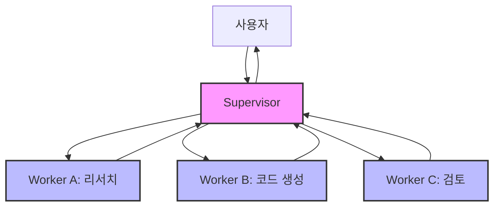
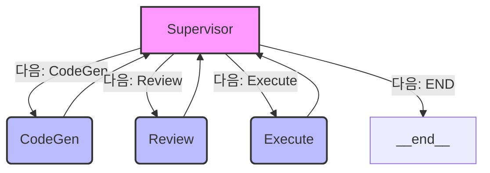

# Supervisor Pattern: 다중 에이전트 아키텍처의 핵심

Supervisor Pattern은 여러 에이전트가 협력하여 복잡한 작업을 수행하는 시스템을 구축할 때 효과적인 아키텍처입니다. 이 패턴은 중앙의 "Supervisor" 에이전트가 전체 작업을 조율하고, 전문화된 "Worker" 에이전트들에게 작업을 분담시키는 방식으로 동작합니다. 이는 마치 오케스트라의 지휘자(Supervisor)가 각 악기 연주자(Worker)에게 지시를 내려 아름다운 하모니를 만들어내는 것과 유사합니다.

## 핵심 개념

| 개념                  | 설명                                                                                                                               |
| :-------------------- | :--------------------------------------------------------------------------------------------------------------------------------- |
| **중앙 감독 (Supervisor) Agent** | 사용자 프롬프트를 받고, 어떤 Worker Agent를 언제 호출할지 결정합니다. 상태, 대화 이력, 품질을 추적하며, 결과를 모아 최종 답변으로 반환합니다. |
| **Worker (전문) Agents**     | 하나의 좁은 역할(예: 리서치, 코드 생성, 검토, 실행 등)에만 집중합니다. Supervisor가 보내 준 입력만 처리하고 다시 Supervisor에게 결과를 돌려줍니다. |
| **단일 통신 채널**       | Worker 간의 직접 통신은 없으며, 모든 통신은 Supervisor를 통해 이루어지는 ★별 버스(broadcast) 형태의 메시지 흐름만 존재합니다. 이를 통해 제어, 감사, 안전 관리가 단순해집니다. |

### 통신 흐름 (Mermaid)



## 왜 Supervisor Pattern을 사용하는가?

*   **복잡도 관리**: 다수의 전문 에이전트를 "한 명의 지휘자에게 물어본다"는 명확한 메타포로 제어하므로, 전체 시스템의 설계와 디버깅이 상대적으로 쉬워집니다.
*   **품질 및 안전 가드레일**: Supervisor가 Worker의 결과를 검증하고, 필요시 재시도를 요청하거나 사람의 개입(Human-in-the-Loop)을 호출할 수 있습니다. 이를 통해 할루시네이션(환각)이나 예상치 못한 비용 폭주를 줄이는 데 도움이 됩니다.
*   **확장성**: 새로운 기능이나 전문성이 필요할 때, 해당 역할을 수행하는 Worker 에이전트를 추가하고 Supervisor의 로직만 일부 수정하면 되므로, 모듈식 확장이 용이합니다.

## 다른 다중-에이전트 패턴과의 비교

| 패턴                      | 통신 구조                                  | 장점                                    | 단점                               |
| :------------------------ | :----------------------------------------- | :-------------------------------------- | :--------------------------------- |
| Network                   | 모든 에이전트가 서로 자유롭게 호출 가능        | 병렬 처리, 탈중앙화된 구조 가능             | 경로 폭발적 증가, 무한 루프 발생 위험성 높음 |
| **Supervisor**            | Supervisor ↔ Worker 간 단일 채널 통신        | 제어 용이, 안전성 확보에 유리                | Supervisor에 병목 현상 또는 단일 장애점 발생 가능 |
| Supervisor (Tool-calling) | Worker를 "툴"로 선언, OpenAI functions처럼 호출 | 프롬프트만으로 동적 라우팅 구현 가능        | 툴(Worker) 중심의 설계 필요         |
| Hierarchical              | Supervisor들의 Supervisor (계층적 구조)    | 매우 크고 복잡한 문제 해결에 적합          | 설계 난이도 높고, 지연 시간 증가 가능성 |

## 구현 스케치 (LangGraph 예시)

LangGraph를 사용하면 Supervisor Pattern을 효과적으로 구현할 수 있습니다. Supervisor 노드가 조건부 엣지(conditional edge)를 통해 다음 Worker 노드를 결정하고, Worker 노드는 작업을 수행한 후 항상 Supervisor 노드로 결과를 반환하는 구조입니다.

```python
from langgraph.graph import StateGraph, END
# my_agents.py 등에 supervisor_node, coder_node 등이 정의되어 있다고 가정
# from my_agents import supervisor_node, coder_node, reviewer_node, exec_node

# 예시를 위한 더미 노드 함수
def supervisor_node(state): print("Supervisor: 다음 작업 결정 중..."); return {"next": "CodeGen", "data": state.get("data", []) + ["Supervisor OK"]}
def coder_node(state): print("Coder: 코드 생성 중..."); return {"data": state.get("data", []) + ["Code Generated"]}
def reviewer_node(state): print("Reviewer: 코드 리뷰 중..."); return {"data": state.get("data", []) + ["Code Reviewed"]}
def exec_node(state): print("Executor: 코드 실행 중..."); return {"data": state.get("data", []) + ["Code Executed"]}


g = StateGraph(dict) # 상태 정의 예시 (간단한 딕셔너리 사용)

# 노드 추가
g.add_node("Supervisor", supervisor_node)
g.add_node("CodeGen", coder_node)
g.add_node("Review", reviewer_node)
g.add_node("Execute", exec_node)

# Supervisor가 다음 노드를 라우팅하는 조건부 엣지 설정
def router(state):
    print(f"Router: 현재 상태 - {state}")
    next_node = state.get("next", "__end__") # 'next' 키가 없으면 종료
    if not state.get("data", []): # 초기 실행 시 Supervisor로
        return "Supervisor"
    # 간단한 예시: 데이터 길이에 따라 다음 노드 결정 또는 종료
    if len(state.get("data", [])) > 5 : # 임의의 종료 조건
        return "__end__"
    return next_node

g.set_entry_point("Supervisor") # Supervisor부터 시작

g.add_conditional_edges("Supervisor",
                        lambda state: state.get("next", "__end__"), # Supervisor의 출력에서 'next' 키를 보고 라우팅
                        {
                            "CodeGen": "CodeGen",
                            "Review": "Review",
                            "Execute": "Execute",
                            "__end__": END
                        })

# Worker 노드는 작업을 마친 후 항상 Supervisor로 돌아감
for worker_node_name in ["CodeGen", "Review", "Execute"]:
    g.add_edge(worker_node_name, "Supervisor")

# 그래프 컴파일
graph = g.compile()
```

### LangGraph 구현 시각화 (Mermaid)


*(요약: Supervisor 노드만 다음 단계를 결정하는 조건부 엣지를 가지며, Worker 노드는 작업 수행 후 항상 Supervisor로 복귀합니다.)*

## 적용 팁 & 모범 사례

| 체크리스트                                            | 이유                                                                   |
| :---------------------------------------------------- | :--------------------------------------------------------------------- |
| **명확한 역할 정의**: Worker별 "입력 → 산출" 계약을 반드시 문서화 | Supervisor의 프롬프트가 간결해지고, 오류 발생 시 디버깅이 쉬워집니다.                 |
| **상태 저장소 공유** (AgentState, Vector DB, Redis 등)       | 에이전트 간 컨텍스트 손실을 방지하고, 일관된 작업 수행을 보장합니다.                       |
| **예산 및 스텝 제한** (토큰 사용량, API 호출 횟수 등)        | 무한 루프나 과도한 비용 발생을 사전에 방지합니다.                                  |
| **Fail-fast 전략**: 일정 실패율 이상이면 Supervisor가 사람 호출 | 최종 결과물의 품질을 보증하고, 잠재적인 문제를 조기에 발견하여 대응할 수 있습니다.         |
| **로깅 및 재현 가능성** (LangSmith, OpenTelemetry 등)     | 시스템의 동작을 추적하고, A/B 테스트나 오류 분석 시 재현성을 확보하는 데 중요합니다. |

## 언제 사용하면 좋은가?

*   **직렬 파이프라인 워크플로우**: 코드 생성 → 코드 리뷰 → 테스트 실행처럼 단계가 명확하게 이어지는 작업.
*   **단계별 전문가가 필요한 업무**: 데이터 분석 (쿼리 작성 → 실행 → 시각화) 등 각 단계마다 다른 전문성이 요구되는 작업.
*   **멀티모달 파이프라인 조정**: 텍스트 입력 → 이미지 생성 → 음성 변환 등 다양한 형태의 데이터를 처리하고 변환하는 복잡한 작업.

## 주의할 점

*   **Supervisor의 토큰 압력**: 모든 컨텍스트와 중간 결과가 Supervisor에게 집중되므로, Supervisor 모델의 컨텍스트 윈도우 한계에 도달할 가능성이 있습니다. 이를 해결하기 위해 Partial context window 전략을 사용하거나, 요약-메모리(summary memory) 기법을 병행하는 것이 좋습니다.
*   **단일 장애점(Single Point of Failure)**: Supervisor가 다운되면 전체 시스템이 멈출 수 있습니다. 중요한 시스템에서는 Supervisor의 **고가용성 배치(예: 이중화)**를 고려해야 합니다.

---

Supervisor Pattern은 작업을 효과적으로 나누고, 중앙의 지휘자(Supervisor)가 전문 에이전트(Worker)들을 지휘하여 복잡한 목표를 달성하도록 하는 매우 실용적인 다중-에이전트 아키텍처입니다. 복잡성을 효과적으로 통제하면서도 시스템 확장을 용이하게 만들어 주기 때문에, 첫 Agentic AI 시스템을 설계할 때 기본 아키텍처로 고려하기에 훌륭한 출발점입니다.

## Supervisor Pattern의 한계

Supervisor Pattern은 많은 장점에도 불구하고 몇 가지 주요 한계점과 고려해야 할 사항들이 있습니다:

1.  **Supervisor 병목 현상 (Bottleneck)**:
    *   모든 작업 요청과 결과가 Supervisor를 거쳐야 하므로, 동시에 많은 Worker가 작동하거나 작업량이 많아지면 Supervisor가 병목 지점이 될 수 있습니다. 이로 인해 전체 시스템의 처리량과 응답 속도가 저하될 수 있습니다.
    *   Supervisor의 처리 능력(예: LLM의 토큰 처리량, API 호출 제한)이 전체 시스템의 성능을 제한할 수 있습니다.

2.  **단일 장애점 (Single Point of Failure)**:
    *   Supervisor 에이전트에 문제가 발생하면 전체 시스템이 중단될 수 있습니다. 이는 특히 미션 크리티컬한 애플리케이션에서 큰 위험 요소가 될 수 있습니다.
    *   이를 완화하기 위해 Supervisor의 이중화(redundancy)나 장애 복구(failover) 메커니즘을 고려해야 하지만, 이는 시스템 복잡도를 증가시킬 수 있습니다.

3.  **Supervisor의 복잡성 증가**:
    *   Worker 에이전트의 수가 많아지거나, 작업 흐름 및 조건부 라우팅 로직이 복잡해질수록 Supervisor의 프롬프트와 내부 로직이 매우 복잡해질 수 있습니다.
    *   이는 Supervisor를 개발하고 유지보수하는 것을 어렵게 만들며, 새로운 Worker를 추가하거나 기존 흐름을 변경하는 작업의 난이도를 높일 수 있습니다.

4.  **컨텍스트 윈도우 제약**: 
    *   Supervisor는 모든 Worker의 작업과 관련된 컨텍스트를 유지하고 다음 단계를 결정해야 하므로, LLM 기반 Supervisor의 경우 컨텍스트 윈도우 제한에 쉽게 도달할 수 있습니다. 이는 장기 실행 작업이나 많은 정보를 처리해야 하는 경우 문제가 될 수 있습니다. 요약, RAG 등의 추가적인 전략이 필요합니다.

5.  **Worker 간 직접적인 협업의 어려움**:
    *   모든 통신이 Supervisor를 거치기 때문에, 두 Worker 에이전트가 긴밀하게 정보를 교환하며 협업해야 하는 특정 작업에는 비효율적일 수 있습니다. Supervisor를 통한 간접적인 정보 교환은 지연을 유발하거나 필요한 정보의 누락을 야기할 수 있습니다.

Supervisor Pattern은 전체 시스템을 단순화하고 에이전트간 충돌을 방지하는 장점이 있지만, 확장성, 내결함성, 고성능이 요구되는 멀티에이전트 환경에서는 병목, 단일 실패지점, 유연성 저하 등의 한계가 명확하게 드러남.

최근에는 분산 제어(Distributed Control), Peer-to-Peer, 협상/의사결정 분산(Decentralized Decision Making) 등의 구조로 Supervisor Pattern의 한계를 극복하려는 시도가 많음.

## 대안적인 다중 에이전트 아키텍처

Supervisor Pattern의 한계를 보완하거나 특정 사용 사례에 더 적합할 수 있는 다른 다중 에이전트 아키텍처 패턴들이 있습니다:

1.  **계층적 Supervisor (Hierarchical Supervisor)**:
    *   **개념**: 여러 Supervisor를 계층적으로 구성합니다. 상위 Supervisor는 더 큰 작업을 하위 Supervisor들에게 분배하고, 하위 Supervisor는 다시 자신의 Worker 에이전트 팀을 관리합니다. 마치 대기업의 조직 구조와 유사합니다.
    *   **장점**: 매우 크고 복잡한 문제를 여러 단계로 나누어 효과적으로 관리할 수 있습니다. 각 Supervisor는 자신의 담당 범위에만 집중하므로 복잡성이 분산됩니다.
    *   **단점**: 전체적인 설계 난이도가 높아지고, 여러 계층을 거치면서 지연 시간이 증가할 수 있습니다. 계층 간 통신 및 상태 관리가 복잡해질 수 있습니다.
    *   **적합한 경우**: 대규모 프로젝트, 여러 독립적인 하위 시스템으로 구성된 애플리케이션.

    ```mermaid
    graph TD
        User --> TopSupervisor[최상위 Supervisor];
        TopSupervisor --> SubSupervisorA[하위 Supervisor A];
        TopSupervisor --> SubSupervisorB[하위 Supervisor B];
        SubSupervisorA --> WorkerA1[Worker A1];
        SubSupervisorA --> WorkerA2[Worker A2];
        WorkerA1 --> SubSupervisorA;
        WorkerA2 --> SubSupervisorA;
        SubSupervisorB --> WorkerB1[Worker B1];
        SubSupervisorB --> WorkerB2[Worker B2];
        WorkerB1 --> SubSupervisorB;
        WorkerB2 --> SubSupervisorB;
        SubSupervisorA --> TopSupervisor;
        SubSupervisorB --> TopSupervisor;
        TopSupervisor --> User;
    ```

2.  **에이전트 네트워크 (Agent Network / Decentralized Approach)**:
    *   **개념**: 모든 에이전트가 동등한 관계에서 필요에 따라 서로 직접 통신하고 협업할 수 있는 탈중앙화된 구조입니다. 특정 중앙 컨트롤러가 없을 수도 있고, 매우 유연한 통신 경로를 가집니다.
    *   **장점**: 높은 유연성과 병렬 처리 능력을 제공합니다. 에이전트들이 자율적으로 작업을 수행하고 서로 도움을 주고받을 수 있어 복잡한 상호작용이 가능합니다.
    *   **단점**: 전체적인 작업 흐름을 제어하고 예측하기 어려울 수 있습니다. 통신 경로가 복잡해지고, 무한 루프나 예기치 않은 동작이 발생할 위험이 있습니다. 디버깅과 모니터링이 어려울 수 있습니다.
    *   **적합한 경우**: 에이전트 간의 동적인 상호작용이 중요하고, 예측 불가능한 상황에 대한 적응성이 요구되는 경우. (예: 시뮬레이션, 게임 AI)

    ```mermaid
    graph TD
        User --> AgentA;
        AgentA <--> AgentB;
        AgentA <--> AgentC;
        AgentB <--> AgentC;
        AgentB <--> AgentD;
        AgentC <--> AgentD;
        AgentD --> User; 
    ```

3.  **협력적 에이전트 팀 (Collaborative Agent Teams)**:
    *   **개념**: 특정 목표를 공유하는 소규모 에이전트 팀들이 존재하며, 팀 내에서는 긴밀하게 협력하고 팀 간에는 필요에 따라 정보를 교환하는 방식입니다. Supervisor 패턴과 네트워크 패턴의 중간 형태일 수 있습니다.
    *   **장점**: 팀 단위로 작업을 분담하여 관리 용이성과 협업의 효율성을 동시에 추구할 수 있습니다.
    *   **단점**: 팀 내부 및 팀 간의 효과적인 통신 프로토콜과 조율 메커니즘 설계가 중요합니다.
    *   **적합한 경우**: 여러 하위 목표를 가진 복잡한 프로젝트, 각 팀이 특정 전문 분야를 담당하는 경우.

4.  **툴 기반 에이전트 (Tool-centric Agents / Function Calling)**:
    *   **개념**: Worker 에이전트의 기능을 LLM이 호출할 수 있는 "툴(tool)" 또는 "함수(function)"로 추상화합니다. 중앙 에이전트(LLM 자체 또는 간단한 오케스트레이터)는 자연어 요청을 이해하고 필요한 툴들을 순차적 또는 병렬적으로 호출하여 작업을 완료합니다. LangChain의 많은 ReAct 에이전트나 OpenAI의 함수 호출 기능이 이와 유사합니다.
    *   **장점**: LLM의 자연어 이해 및 추론 능력을 활용하여 동적으로 작업 흐름을 구성할 수 있습니다. 상대적으로 간단하게 구현할 수 있으며, 새로운 툴(Worker)을 추가하기 용이합니다.
    *   **단점**: 복잡한 조건부 로직이나 여러 단계에 걸친 상태 관리가 필요한 경우, LLM 프롬프트만으로는 한계가 있을 수 있습니다. 툴 실행 순서나 오류 처리에 대한 명시적인 로직이 필요할 수 있습니다.
    *   **적합한 경우**: 다양한 API나 서비스를 조합하여 사용자 요청을 처리해야 하는 경우, 비교적 명확한 입력과 출력을 가진 기능들을 통합하는 경우.

5.  **Swarm Intelligence (스웜 인텔리전스 또는 집단 지능) Pattern**:
    *   **개념**: 다수의 비교적 단순하고 자율적인 에이전트들이 중앙 통제 없이, 각자의 로컬 규칙과 주변 에이전트 및 환경과의 상호작용을 통해 집단적으로 복잡한 문제를 해결하거나 목표를 달성하는 방식입니다. 개미 군집, 새떼, 물고기 떼 등의 자연 현상에서 영감을 받았습니다. 각 에이전트는 제한된 정보만을 가지지만, 전체 시스템은 분산된 의사결정을 통해 지능적인 행동, 자기 조직화(self-organization), 그리고 적응성을 나타냅니다. 이는 앞서 언급된 "에이전트 네트워크"의 한 형태로 볼 수 있으며, 특히 에머전트 행동(emergent behavior)을 강조합니다.
    *   **장점**:
        *   **견고성 (Robustness)**: 중앙 제어 지점이 없으므로 일부 에이전트가 실패하더라도 전체 시스템은 계속 작동할 가능성이 높습니다. (No Single Point of Failure)
        *   **확장성 (Scalability)**: 시스템에 새로운 에이전트를 추가하기가 비교적 용이하며, 에이전트 수의 증가에 따라 시스템 성능이 선형적으로 또는 그 이상으로 향상될 수 있습니다.
        *   **적응성 및 유연성**: 환경 변화에 대해 각 에이전트가 로컬에서 대응하고, 이러한 로컬 대응이 모여 전체 시스템의 적응적 행동을 유도합니다. 동적인 환경에 적합합니다.
        *   **병렬 처리**: 다수의 에이전트가 동시에 작업을 수행하거나 정보를 처리할 수 있어 효율적입니다.
    *   **단점**:
        *   **예측 불가능성 및 제어의 어려움**: 에머전트 행동은 예측하거나 정밀하게 제어하기 어려울 수 있습니다. 원하는 결과를 얻기 위한 에이전트의 로컬 규칙 설계가 매우 복잡하고 반복적인 실험을 요구할 수 있습니다.
        *   **최적 해 보장의 어려움**: 항상 최적의 해결책을 찾는다는 보장이 없습니다. 경우에 따라 차선의 해답에 머무를 수 있습니다.
        *   **디버깅 및 분석의 복잡성**: 시스템 전체의 행동이 개별 에이전트의 단순한 상호작용에서 비롯되므로, 문제가 발생했을 때 원인을 추적하거나 시스템을 분석하기 어려울 수 있습니다.
        *   **초기 설계의 난이도**: 개별 에이전트의 행동 규칙, 상호작용 방식, 환경과의 인터페이스 등을 통해 원하는 집단적 행동을 유도하는 것이 핵심이며, 이는 상당한 설계 노력을 필요로 합니다.
    *   **적합한 경우**:
        *   분산 탐색 및 최적화 문제 (예: 복잡한 공간에서의 경로 찾기, 자원 할당 최적화).
        *   로보틱스 (다중 로봇 시스템의 협업 및 군집 제어).
        *   데이터 클러스터링 및 패턴 인식.
        *   복잡계 시뮬레이션 (예: 교통 흐름, 도시 성장 모델링).
        *   명확한 중앙 집중식 제어가 어렵거나 바람직하지 않은 분산 환경.

어떤 아키텍처를 선택할지는 해결하려는 문제의 복잡성, 필요한 에이전트의 수와 다양성, 에이전트 간 상호작용의 형태, 시스템의 확장성 및 유지보수 요구사항 등 다양한 요소를 고려하여 결정해야 합니다. 종종 이러한 패턴들을 조합한 하이브리드 형태의 아키텍처가 실제 문제 해결에 더 효과적일 수 있습니다.