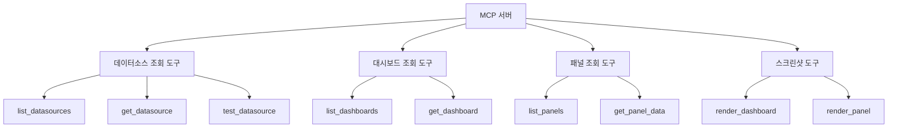
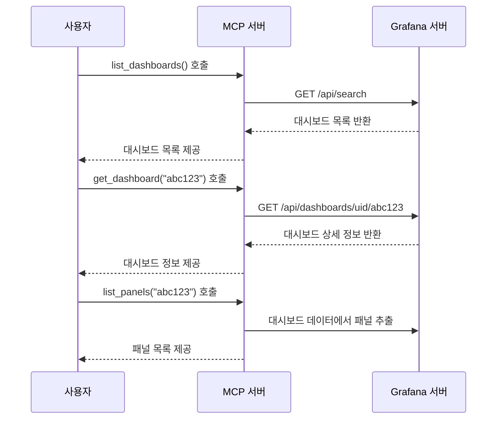
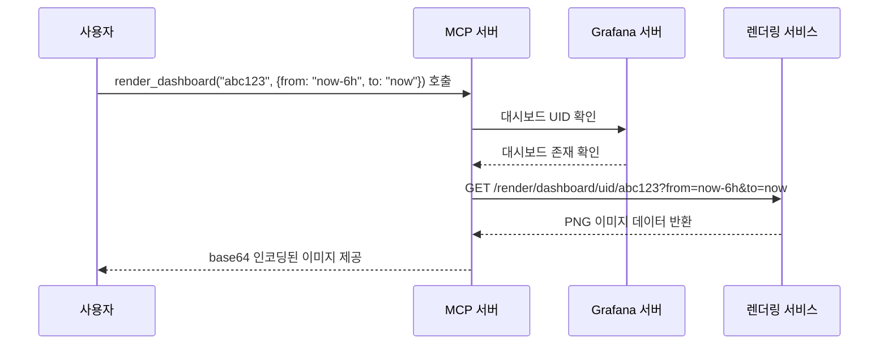
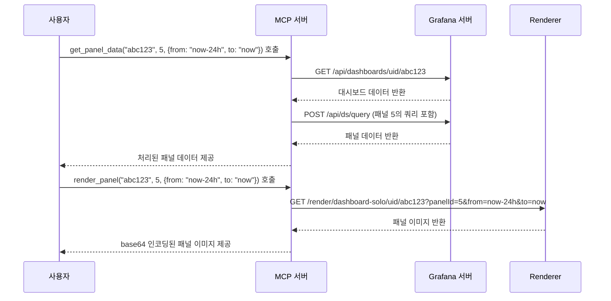

# Grafana Dashboard MCP API

이 문서는 Grafana 대시보드와 관련 기능을 MCP(Model Context Protocol)를 통해 제공하는 API를 설명합니다.

## 제공 API 개요

MCP 서버를 통해 Grafana의 다음 **조회 기능**을 제공합니다:

1. **데이터소스 조회** - Grafana 데이터소스 목록 및 상세 정보 조회
2. **대시보드 조회** - 대시보드 목록 및 상세 정보 조회
3. **패널 조회** - 특정 대시보드 내 패널 목록 및 데이터 조회
4. **스크린샷 생성** - 대시보드와 패널의 이미지 렌더링

## MCP 도구 목록



## API 세부 사항

### 데이터소스 조회 도구

#### list_datasources
```python
def list_datasources() -> List[Dict[str, Any]]:
    """Grafana의 모든 데이터소스 목록을 반환합니다.
    
    Returns:
        List[Dict[str, Any]]: 데이터소스 목록
    """
```

#### get_datasource
```python
def get_datasource(id_or_name: str) -> Dict[str, Any]:
    """특정 데이터소스의 상세 정보를 반환합니다.
    
    Args:
        id_or_name: 데이터소스의 ID 또는 이름
        
    Returns:
        Dict[str, Any]: 데이터소스 상세 정보
    """
```

#### test_datasource
```python
def test_datasource(id_or_name: str) -> Dict[str, Any]:
    """데이터소스 연결을 테스트합니다.
    
    Args:
        id_or_name: 테스트할 데이터소스의 ID 또는 이름
        
    Returns:
        Dict[str, Any]: 테스트 결과
    """
```

### 대시보드 조회 도구

#### list_dashboards
```python
def list_dashboards(folder_id: Optional[int] = None, query: Optional[str] = None) -> List[Dict[str, Any]]:
    """대시보드 목록을 반환합니다.
    
    Args:
        folder_id: 특정 폴더의 대시보드만 필터링 (선택 사항)
        query: 검색 쿼리 (선택 사항)
        
    Returns:
        List[Dict[str, Any]]: 대시보드 목록
    """
```

#### get_dashboard
```python
def get_dashboard(uid: str) -> Dict[str, Any]:
    """특정 대시보드의 상세 정보를 반환합니다.
    
    Args:
        uid: 대시보드 UID
        
    Returns:
        Dict[str, Any]: 대시보드 상세 정보
    """
```

### 패널 조회 도구

#### list_panels
```python
def list_panels(dashboard_uid: str) -> List[Dict[str, Any]]:
    """특정 대시보드에 포함된 패널 목록을 반환합니다.
    
    Args:
        dashboard_uid: 대시보드 UID
        
    Returns:
        List[Dict[str, Any]]: 패널 목록
    """
```

#### get_panel_data
```python
def get_panel_data(dashboard_uid: str, panel_id: int, time_range: Dict[str, str]) -> Dict[str, Any]:
    """특정 패널의 데이터를 쿼리합니다.
    
    Args:
        dashboard_uid: 대시보드 UID
        panel_id: 패널 ID
        time_range: 시간 범위 (from, to)
        
    Returns:
        Dict[str, Any]: 패널 데이터
    """
```

### 스크린샷 도구

#### render_dashboard
```python
def render_dashboard(dashboard_uid: str, time_range: Dict[str, str], width: int = 1000, height: int = 500, theme: str = "light") -> str:
    """대시보드 이미지를 렌더링합니다.
    
    Args:
        dashboard_uid: 대시보드 UID
        time_range: 시간 범위 (from, to)
        width: 이미지 너비 (픽셀)
        height: 이미지 높이 (픽셀)
        theme: 테마 ("light" 또는 "dark")
        
    Returns:
        str: base64로 인코딩된 이미지 데이터
    """
```

#### render_panel
```python
def render_panel(dashboard_uid: str, panel_id: int, time_range: Dict[str, str], width: int = 500, height: int = 300, theme: str = "light") -> str:
    """패널 이미지를 렌더링합니다.
    
    Args:
        dashboard_uid: 대시보드 UID
        panel_id: 패널 ID
        time_range: 시간 범위 (from, to)
        width: 이미지 너비 (픽셀)
        height: 이미지 높이 (픽셀)
        theme: 테마 ("light" 또는 "dark")
        
    Returns:
        str: base64로 인코딩된 이미지 데이터
    """
```

## 사용 시나리오 예시

### 시나리오 1: 대시보드 및 패널 탐색



### 시나리오 2: 대시보드 스크린샷 생성



### 시나리오 3: 패널 데이터 분석



## 구현 시 고려사항

1. 인증 및 권한 처리
2. 읽기 전용 접근 제한 
3. 에러 핸들링
4. 대용량 데이터 및 이미지 처리
5. 캐싱 전략
6. 타임아웃 및 재시도 메커니즘
